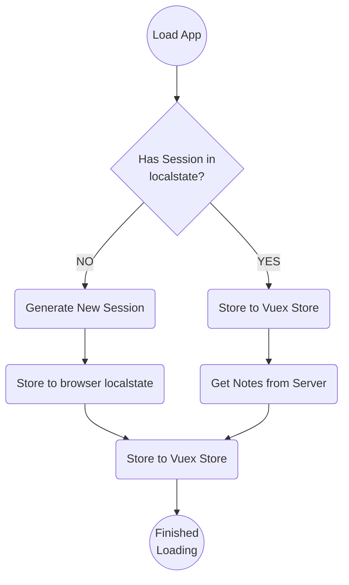

# surfe-vue

[Frontend challenge](https://web.archive.org/web/20231023224845/https://work.surfe.com/front-end-engineer-typescript-react/front-end-coding-challenge) for Surfe build with Vue 2 and Vite.


### Running the project
1. `cd` into `surfe-vue`
2. Install dependencies with `npm i`
3. Create a `.env.local` file and add the values described in **Environment Variables** further below
4. Run it with `npm run dev`

### Build it

```sh
npm run build
```

### Run Unit Tests

```sh
npm run test:unit
```

### Lint

```sh
npm run lint
```

## Implementation Details

### Environment Variables
`VITE_API_ENDPOINT=https://challenge.surfe.com`

### UI/UX 

1. The UI follows a mobile-first approach, reflected by how the breakpoint mixins are applied;

### Project Structure

- `api/` holds our API service;
- `store/` has a Vuex data store, with the context of `notes`, `users` and `notifications` split in modules;
- `components/` hold our Vue components for Note, as well as `ui/` with individual reusable UI componentes;
- `assets/` holds our SCSS;

### CSS

1. CSS class naming follows BEMIT convention;
2. CSS attributes are ordered alphabetically;
3. We make use of SCSS preprocessor mainly for Mixins and Nesting; Native CSS custom properties are prefered over SCSS variables;

### Editable Content

1. Editing of the Note's body is done with our own implementation of a `contenteditable` element;
2. Mentioning a user works much like Slack: to trigger a mention suggestion the user must type in `@` followed by the string. Once the menu shows up they can navigate to the corresponding match and select it with the keyboard;

### Deployment

1. Project is hosted on Netlify;
2. Env variables must be set within Netlify directly;

### Session Loading Lifecycle

The app will try to load Notes from an existing localstate value. If none exists, one is created and later used.




## Missing

1. Adding unit-test to Components and utility Functions;
2. Adding Playwright for end-to-end testing;
3. Improve Aaccessibility;
4. Allow for darkmode;
5. Account cross-browser compatibility;
6. Move content editable code into dedicated component;
