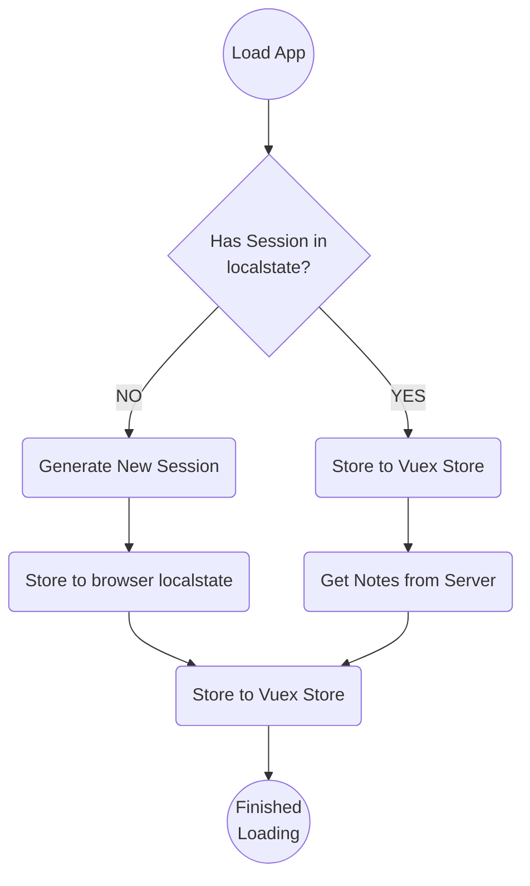

# surfe-vue

Frontend challenge for Surfe.

### Running the project
1. `cd` into `surfe-vue`
2. Install dependencies with `npm i`
3. Run it with `npm run dev`

### Build it

```sh
npm run build
```

### Run Unit Tests

```sh
npm run test:unit
```

### Lint

```sh
npm run lint
```

## UI/UX Implementation Details

1. The UI follows a mobile-first approach, reflected by how the breakpoint mixins are applied;
2. CSS class naming follows BEMIT convention;
3. CSS attributes are ordered alphabetically;
4. We make use of SCSS preprocessor mainly for Mixins and Nesting; Native CSS custom properties are prefered over SCSS variables;

## Session Loading Lifecycle

The app will try to load Notes from an existing localstate value. If none exists, one is created and later used.

### Flow

